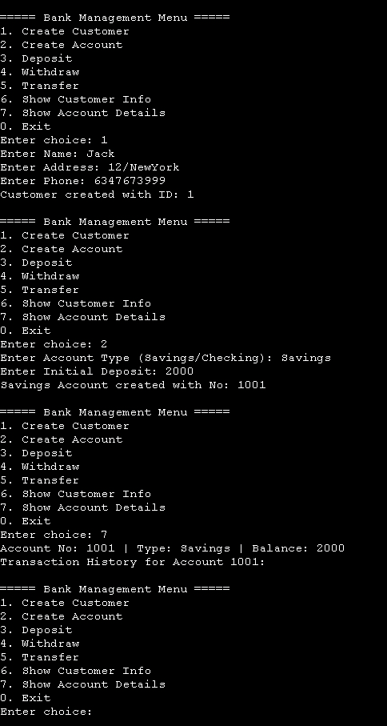

# 🏦 Banking System (C++ + MySQL)

This project is a **Banking System** implemented in **C++** with an **Object-Oriented Programming (OOP)** approach and backed by **MySQL** for data storage.  
It simulates basic banking operations like customer management, account handling, and transaction processing.

---

## 🚀 Features
- **Customer Management**
  - Add new customers
  - Store customer details (name, email, phone, etc.)
  - View customer information
- **Account Management**
  - Create savings, current, or fixed accounts
  - View account details and balances
- **Transactions**
  - Deposit money
  - Withdraw money
  - Transfer money between accounts
  - View transaction history
- **Database Integration**
  - Persistent data storage using MySQL
  - Customers ↔ Accounts ↔ Transactions relationship

---

## 🛠️ Technologies Used
- **C++** (Object-Oriented Programming)
- **MySQL** (Database for persistent storage)
- **MySQL Connector for C++** (Database connectivity)
- **OOP Concepts** (Encapsulation, Inheritance, Polymorphism)

---

## 🗄️ Database Schema
### Tables
1. **Customers**
   - `customer_id (PK)`
   - `name`
   - `email`
   - `phone`
   - `created_at`

2. **Accounts**
   - `account_id (PK)`
   - `customer_id (FK → Customers.customer_id)`
   - `account_type (SAVINGS, CURRENT, FIXED)`
   - `balance`
   - `created_at`

3. **Transactions**
   - `transaction_id (PK)`
   - `account_id (FK → Accounts.account_id)`
   - `tx_type (DEPOSIT, WITHDRAWAL, TRANSFER)`
   - `amount`
   - `timestamp`
   - `remarks`
  
---

## 🎥 Demo

Here’s how the Banking System looks in action:

### 🖼️ Screenshot

